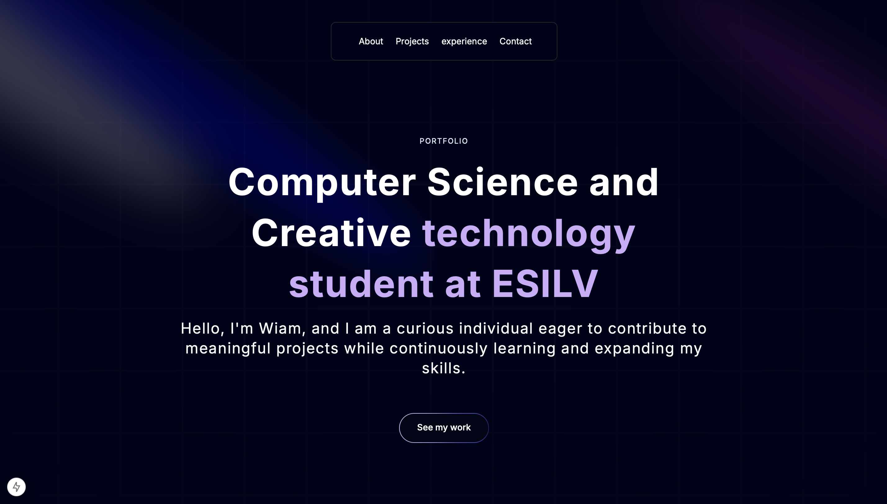

# My Portfolio 🖥️

Welcome to my personal portfolio. This project showcases my work, experiences, and skills in a designed and interactive website built with modern web technologies.

## 📸 Preview 



## 🛠️ Built With  

- **[Next.js](https://nextjs.org/)**: A powerful React framework for building fast and scalable web applications.  
- **[Aceternity UI](https://github.com/aceternity-ui)**: A custom design system used to create beautiful, responsive, and accessible UI components.  
- **[React Icons](https://react-icons.github.io/react-icons/)**: To add intuitive and eye-catching icons throughout the site.  
- **Modern CSS**: Leveraging Tailwind CSS, Flexbox, Grid, and utility-first classes for a sleek and responsive layout.  

---

## 🎨 Features  

- ✨ **Dynamic Sections**: Each section of the portfolio is dynamically rendered for seamless updates and customization.  
- ⚡ **Optimized Performance**: Images, fonts, and other assets are optimized using Next.js features like `next/image` and `next/font`.  
- 📱 **Responsive Design**: Ensures the site looks great on all screen sizes, from desktops to mobile devices.  
- 🎯 **Interactivity**: Interactive elements like buttons, transitions, and animations enhance the user experience.  

---

## 🛠️ Getting Started  

To explore or modify the project, follow these steps:  

### Clone the Repository  
```bash
git clone <repo_url>
cd portfolio


### Getting Started

First, run the development server:

```bash
npm run dev
# or
yarn dev
# or
pnpm dev
# or
bun dev
```

Open [http://localhost:3000](http://localhost:3000) with your browser to see the result.

## Make Changes  

Edit `app/page.tsx` or other components to customize the site. Changes will automatically reflect in your browser.  

---

## 📖 Learn More  

Explore more about the technologies used:  

- [Next.js Documentation](https://nextjs.org/docs)  
- [Aceternity UI](https://github.com/aceternity-ui)  
- [React Icons](https://react-icons.github.io/react-icons/)  

---
## 💡 Acknowledgments  

This portfolio is inspired by the amazing work of [Adrian Hajdin](https://github.com/adrianhajdin/portfolio/tree/main). Check out his [YouTube tutorial](https://www.youtube.com/watch?v=FTH6Dn3AyIQ) for an in-depth guide to building portfolios like this. 

---

## Deploy on Vercel

The easiest way to deploy your Next.js app is to use the [Vercel Platform](https://vercel.com/new?utm_medium=default-template&filter=next.js&utm_source=create-next-app&utm_campaign=create-next-app-readme) from the creators of Next.js.

Check out our [Next.js deployment documentation](https://nextjs.org/docs/app/building-your-application/deploying) for more details.
